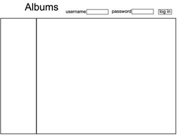
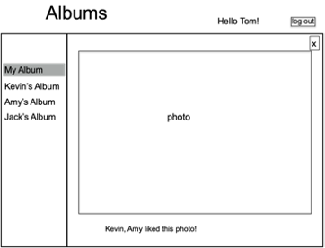
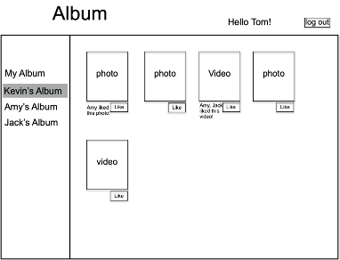

 

> <u>**To run this Album sharing app, you need to set up MongoDB and nodeJS locally.**</u>
>
> * The code for database generating is in `generate-db.js`
> * data should be stored in `data/`
> * copy a complete `node_modules` file into the directory from any initial Express app


# Overview 

We are required to develop a web-based **Album sharing app** using **NodeJS/Express.js**, **JavaScript/jQuery**, **AJAX**, **HTML** and **CSS** for our assignment. The application implements a few simplified functionalities, including displaying photos/videos in albums, switching between different album pages, and posting likes on a photo/video. <u>Below shows the demo given by our professor. The actual page I made was slightly different (especially on UI).</u> I will update some demo pictures for my impleted app later. The main workflow of the **Album app** is as follows. 

* Upon loading, the sketch of the page is shown in <u>Fig. 1</u>: 



<center><b>Fig. 1</b></center>

* After a user has logged in, the sketch of the page is in <u>Fig. 2</u>. A list of friend albums is shown in the left division. 


<center><b>Fig. 2</b></center>

* After clicking “My Album”, the sketch of the page is in <u>Fig. 3</u>. The photos/videos in the user’s own albums are displayed in the right division, together with messages of who liked a photo/video. If there are more than one page of photos/videos, the user can click “<previous” or “next>” to go to the previous or next page of photos/videos in this album. 

  

  <center><b>Fig. 3</b></center>
  
  Each photo/video is clickable. After clicking a photo/video, the photo/video will be enlarged as in <u>Fig. 4a</u> and <u>Fig. 4b</u>, together with the “liked” message . When the cross X is clicked, the page returns to the view as shown in <u>Fig. 3</u> (the page before the photo/video is clicked). 



<center><b>Fig. 4a</b></center>


<center><b>Fig. 4b</b></center

* When a friend’s album is selected in the left-hand list, the page view becomes one in <u>Fig. 5</u>. Photos/videos of the friend are shown in the right division, together with messages of who liked a photo/video and the like buttons. (“<previous” and “next>” are not shown if an album has less than one page of photos/videos, and shown, otherwise.) 

  

  <center><b>Fig. 5</b></center>
  
  Similarly, when a photo/video is clicked, the photo/video will be enlarged as in <u>Fig. 6a</u> and <u>Fig. 6b</u>, together with the “liked” message and the like button. When the cross is clicked, the page returns to the view shown in <u>Fig. 5</u> (the page before the photo/video is clicked). 


<center><b>Fig. 6a</b></center>


<center><b>Fig. 6b</b></center>

# Structure

The web-based album sharing application is implemented by the following code in an Express app: 

```tree
app.js 

./public/albums.html 

./public/javascripts/script.js 

./public/stylesheets/style.css 
```

and accessed at http://localhost:8081/albums.html. 