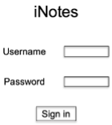
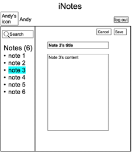

> <u>**To run this Album sharing app, you need to set up MongoDB and nodeJS locally and pull a React app.**</u>
>
> * The code for database generating is in `generate-db.js`
> * data should be stored in `data/`
> * copy a complete `node_modules` file into the directory from any initial Express app
> * after you pull a React app, substitude all files except `README.md` in this directory into your React app.


# Overview 

We are required to develop a simple single-page **iNotes application** using the MERN stack (**MongoDB**, **Express.JS**, **ReactJS**, and **Node.js**). <u>Below shows the demo given by our professor. The actual page I made was slightly different (especially on UI).</u> I will update some demo pictures for my impleted app later. The main workflow of the iNotes application is as follows. 

* Upon loading, the sketch of the page is shown in <u>Fig. 1</u>: 

<div align="center"></div>

<div align="center"><b>Fig. 1</b></div> 

* After a user (e.g., Andy) has logged in, the sketch of the page is in <u>Fig. 2</u>. The user’s icon, user name and a logout button are displayed on the top. A list of this user’s notes are shown on the left panel (note title only) together with a search bar, and the right panel is empty except an icon indicating the creation of a new note (i.e., the “New note icon”). The note titles in the left panel should be listed in reverse chronological order of the last saved time of the notes. The total number of notes should be given in the ( ) on the top of the list. 

<div align="center"></div>

<div align="center"><b>Fig. 2</b></div>

* After one clicks on the “New note icon” (on any page view where it is shown), a new note creation panel shows in the right panel (<u>Fig. 3</u>). There is a note title input field and a note content input field, into which the user can enter texts. There is a “Cancel” button, clicking which a confirmation box “Are you sure to quit editing the note?” will be popped up: if the user confirms quitting, the page view goes back to the one shown in <u>Fig. 2</u>; otherwise, the current page view remains. There is a “Save” button, clicking which the newly created note is shown on the right panel, with the “Last saved” time and a “Delete” button displayed on top of the note, as shown in <u>Fig. 4</u>; besides, the note title should be listed in the left panel, as the first in the list (as it is the latest), the note title should be highlighted in a different color than the rest of the note titles in the list (since this note’s content is shown in the right panel), and the total number of notes in ( ) on top of the list should be incremented. 

<div align="center"></div>

<div align="center"><b>Fig. 3</b></div>

<div align="center"></div>

<div align="center"><b>Fig. 4</b></div>

* At any time, when one clicks on one note title in the left panel, the note’s content should be displayed in the right panel, as shown in <u>Fig. 5</u> (which is in fact the same page view as <u>Fig. 4</u>), and the note title in the left panel should be highlighted. On the page view (i.e., <u>Fig. 4</u> or <u>Fig. 5</u>’s page view), if one clicks into the note title input field or note content input field, the page view changes to the one in Fig. 6, with a “Cancel” button and a “Save” button (indicating a note editing mode). When “Cancel” is clicked, a confirmation box “Are you sure to quit editing the note?” will be popped up: if the user confirms quitting, the page goes back to the previous note view (<u>Fig. 4</u> or <u>Fig. 5</u>); otherwise, the current page view remains. When “Save” is clicked, a page view as in <u>Fig. 4</u> or <u>Fig. 5</u> is shown, except that the “Last saved” time on the top of the right panel should be the updated latest note saved time. 

<div align="center"></div>

<div align="center"><b>Fig. 5</b></div>

<div align="center"></div>

<div align="center"><b>Fig. 6</b></div>

* One can input a search string into the search bar at the top of the left panel and press “Enter” on the keyboard. Then only the notes whose title or content contains the search string will be listed in the left panel, ordered in reserve chronological order of their last saved time, and the number in ( ) shows the number of matched notes. On a page view as in <u>Fig. 3, 4, 5</u> or <u>6</u>, the search does not influence the display in the right panel, and if the note whose details are displayed in the right panel matches the search, its title in the searched list in the left panel should be highlighted. For a search on a page view as in <u>Fig. 6</u>, last saved title and content of the note that is being edited are used for matching the search; when the note is saved, if its title and content do not match the search, it will not be displayed in the searched list in the left panel. 
* On a page view as in <u>Fig. 4</u> or <u>Fig. 5</u>, after one clicks the “Delete” button, a confirmation box pops up showing “Confirm to delete this note?” If the user confirms the deletion, the note information will be removed from both the left and right panels. In the left panel, the total note number will be decremented; the right panel will show no note information as in <u>Fig. 2</u>. If the user cancels the deletion, the page view remains unchanged. 
* When one clicks the “log out” button on a page view as in <u>Fig. 2, 4</u> or <u>5</u>, the page view directly goes back to <u>Fig. 1</u>. When one clicks the “log out” button on a page view as in <u>Fig. 3</u> or <u>6</u>, an alert box “Are you sure to quit editing the note and log out?” will be popped up: if the user confirms quitting, the page view goes back to <u>Fig. 1</u>; otherwise, the current page view remains. 

# Structure

This web application is achieved by implementing code in a backend Express app and a frontend React app. 

* Express app: 

  ```tree
  iNotes_express/app.js 
  iNotes_express/routes/notes.js 
  ```

* React app: 

  ```tree
  iNotes_react/src/App.js 
  
  iNotes_react/src/index.js 
  
  iNotes_react/src/App.css 
  ```

# Launch

* The web service is accessed at http://localhost:3001/xx.
* The React application is accessed at http://localhost:3000/.
* The Express app is launched using command `node app.js`

# Code implementation

## NoteService

### app.js

* set cors

* use the database named `assignment2`

* set session

* `app.use(cors({credentials: true, origin: 'http://localhost:3000'}));`: to send `withCredential` boolean true in ajax

* etc.

### notes.js

* `function getDate()`: this function serves to extract the current date and time from `new Date()` object and format it into the required format, used when saving a note, adding a note, etc.
  * An example of the final format: 10:02:20 Nov 18 2022


## noteapp

### App.js

* `function noteSort()`: This function serves as the function used in the Array.sort() to sort the notes in the left pane in **reverse chronological order** of the last saved time of the notes. This is done by extracting the `hh:mm:ss` and the `MMM dd yyyy` from the `lastsavedtime` and feeding the combination into `Date()` to generate a Date Object, which is then used for comparison.

* `function NoteListRow()`: This function returns the `div` element with each note's title, which will be displayed in the left pane.

* `class SignInPage`: This implements the page upon opening iNoteApp (i.e., the page to be shown before login and after logout).
  * `handleSignIn()`: triggered when user intended to **log in**

* `class SearchBar`: This implements the search bar in the left pane.
  * `handleSearchNotes()`: triggered when user intended to **search notes**

* `class NoteList`: This implements the **left** pane.
  * `handleSearchNotes()`: triggered when user intended to search notes, by `handleSearchNotes()` in `SearchBar`
  * `handleNoteSelected()`: triggered when user clicked a certain note listed in the left pane

* `class NoteDetail()`: This implements the **right** pane
  * `handleDeleteNote`: triggered when user click `delete` button
  * `changeEditMode`: exit or enter into editting mode
  * `changeToEdittingMode`: triggered when user click `new note` button, click into either the title textarea or the content textarea, with the display of `lastsavedtime` and the `delete` button replace by a `save` and a `cancel` button
  * `cancelFromEdittingMode`: triggered when user click `calcel` button
  * `saveAndQUitEdittingMode`: triggered when user click `save` button
  * `addNote`: triggered when user click `new note` and then click `save` after certain edit

* `class LoggedInMessage`: This implements the info that shows above the pane
  * `handleSignOut`: triggered when user click `log out` button

* `class INoteApp`: The whole page
  * `componentDidUpdate`: In this function, the selected note, if appearing in the left pane, will be highlighted, while the others not
  * other functions are triggered by functions in other classes and are implemented to set the state of the class


 

 
